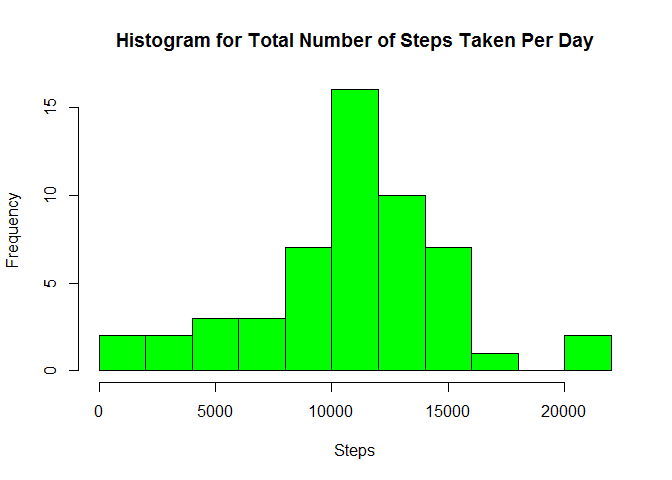
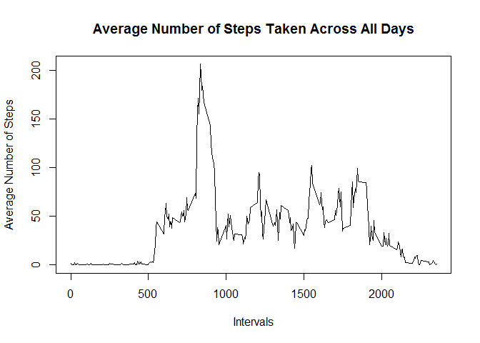
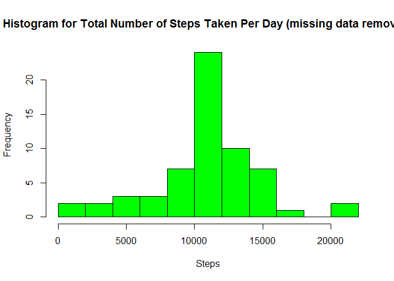
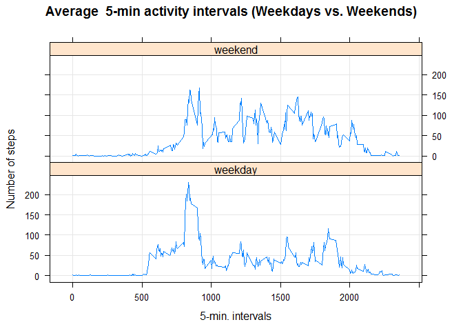

# Peer Assignment for Reproducible Research, due week 2
    
This assignment will be described in multiple parts.  The completed assignment will be submitted as a single Markdown file, processed by knitr and be transformed into an HTML file.  
Throughout the report, code will be included and the use of echo = TRUE will be used so someone else can read the code.  
  
Load appropriate libraries

```r
library(ggplot2)
library(lattice)
library(knitr)
```
    
##Load and process the data
###Load the data and transform data if necessary

```r
data1 <- read.csv("activity.csv")
```
  
##What is mean total number of steps taken per day?
###1. Calculate the total number of steps taken per day

```r
data<-na.omit(data1) #safe to assume we omit missing data
stepsperday <- aggregate(steps ~ date, data, sum)
colnames(stepsperday) <- c("date","steps")
head(stepsperday)
```

```
##         date steps
## 1 2012-10-02   126
## 2 2012-10-03 11352
## 3 2012-10-04 12116
## 4 2012-10-05 13294
## 5 2012-10-06 15420
## 6 2012-10-07 11015
```
  
###2. Make a histogram of the total number of steps taken per day

```r
hist(stepsperday$steps, 
     main="Histogram for Total Number of Steps Taken Per Day", 
     xlab="Steps", 
     col="green",
     breaks=10
     )
```

 
  
###3. Calculate and report the mean and median of the total number of steps taken per day  
The mean is:

```r
mean(stepsperday$steps)
```

```
## [1] 10766.19
```
The median is:

```r
median(stepsperday$steps)
```

```
## [1] 10765
```
  
##What is the average daily activity pattern?  
###1.Make a time series plot (i.e. type="l") of the 5 minute interval (x-axis) and the average number of steps taken, averaged across all days (y-axis)

```r
tableintsteps<-aggregate(steps~interval, data, mean)
plot(tableintsteps$interval, tableintsteps$steps, type='l', col=1, main="Average Number of Steps Taken Across All Days", xlab="Intervals", ylab="Average Number of Steps")
```

 
  
###2. Which 5 minute interval, on average across all the days in the dataset, contains the maximum number of steps?

```r
maxstepint_rowid<-which.max(tableintsteps$steps)
tableintsteps[maxstepint_rowid,]
```

```
##     interval    steps
## 104      835 206.1698
```
  
##Input missing values  
Note that there are a number of days/intervals where there are missing values (coded as NA). The presence of missing days may introduce bias into some calculations or summaries of the data.
###1. Calculate and report the total number of missing values in the dataset(i.e. the total number of rows with NAs)

```r
sum(is.na(data1$steps))
```

```
## [1] 2304
```

```r
sum(is.na(data1$date))
```

```
## [1] 0
```

```r
sum(is.na(data1$interval))
```

```
## [1] 0
```
  
There are 2304 missing values for the steps variable, however the date and interaval data is complete.  

###2.Devise a strategy for filling in all of the missing values in the dataset.  The strategy does not needd to be sophisticated. For example, you could use the mean/median for that day, or the mean for that 5 minute interval.  
Use the average steps per interval (over all days) to replace missing values.  

```r
meanstepperint <-aggregate(steps~interval, data=data1, FUN="mean", na.exclude=TRUE)
str(meanstepperint)
```

```
## 'data.frame':	288 obs. of  2 variables:
##  $ interval: int  0 5 10 15 20 25 30 35 40 45 ...
##  $ steps   : num  1.717 0.3396 0.1321 0.1509 0.0755 ...
```
  
###3.Create a new dataset that is equal to the original dataset but with the missing data filled in.

```r
datacomplete<-data1
for(r in 1:nrow(datacomplete)){
  if(is.na(datacomplete$steps[r])){
    replace <- meanstepperint$steps[meanstepperint$interval == datacomplete$interval[r]];
    datacomplete$steps[r] <- replace; 
  }
}
```
  
###4.Make a histogram of the total number of steps taken each day and calculate and report the mean and the median total number of steps taken per day. Do these values differ from the estimates from the first part of the assignment? What is the impact of imputing missing data o the estimates of the total daily number of steps? 

```r
sumstepsdatacomplete<-aggregate(steps~date, data=datacomplete, sum)
hist(sumstepsdatacomplete$steps, 
     main="Histogram for Total Number of Steps Taken Per Day (missing data removed)", 
     xlab="Steps", 
     col="green",
     breaks=10,     
     )
```

 
   
The mean is:

```r
mean(sumstepsdatacomplete$steps)
```

```
## [1] 10766.19
```
  
  The median is:

```r
median(sumstepsdatacomplete$steps)
```

```
## [1] 10766.19
```
  
The impact of estimating missing data and adding that back into the data set does not change the shape of the histogram.  Also, the mean and median are not very different than previously calculated when the missing data was included.  

##Are there differences in activity patterns between weekdays and weekends?
###For this part, the weekdays() function may be of some help here. Use the dataset with the filled in missing values for this part.  
###1. Create a new factor variable in the dataset with two levels - 'weekday' and 'weekend' indicating whether a given date is a weekday or weekend day.

```r
datacomplete$day <- "weekday"
datacomplete$day[weekdays(as.Date(datacomplete$date), abb=T) %in% c("Sat","Sun")] <- "weekend"
table(datacomplete$day)
```

```
## 
## weekday weekend 
##   12960    4608
```
  
###2. Make a panel plot containing a time series plot (i.e. type="l") of the 5 minute interval (x-axis) and the average number of steps taken, averaged across all weekday days or weekend days (y-axis). See the README file in the GitHub repository to see an example of what this plot should look like using simulated data.

```r
meancomplete <- aggregate(steps ~ interval + day, data=datacomplete, FUN="mean")
xyplot(steps ~ interval | day, data=meancomplete, type="l", grid=T, layout=c(1,2), ylab="Number of steps", xlab="5-min. intervals", main="Average  5-min activity intervals (Weekdays vs. Weekends)")
```

 
  
